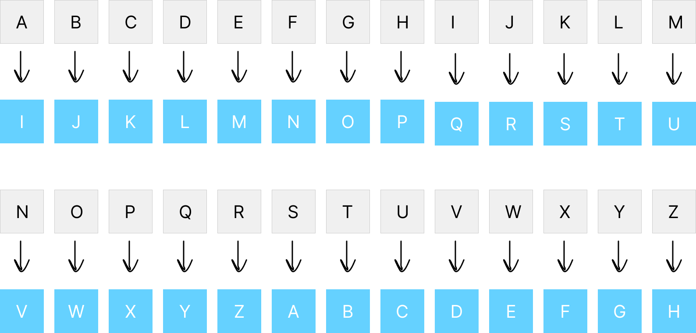

# Exercício - Mapa de Conversão
O exercício trata da utilização de uma das técnicas mais antigas de criptografia: A cifra de César. Nela há a substituição direta de um caractere por outro utilizando como critério um número fixo para o deslocamento no alfabeto.

## Exercício
1. Escreva seu nome, utilizando a técnica apresentada. Para a quantidade de casas, você deve usar a quantidade de letras do seu primeiro nome, por exemplo:

```
Nome: Bruno; Letras: 5; Nome criptografado: Gwzst
```

*Resposta:*
```
Nome: Henrique; Letras: 8; Nome criptografado: Pmvzqycm
```

2. Escreva um mapa, assim como na imagem inicial, de todo o alfabeto, usando a quantidade de casas definida pelo seu nome.



